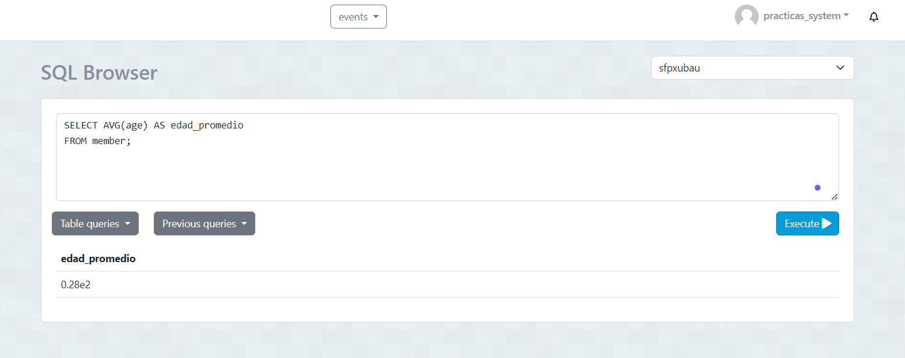
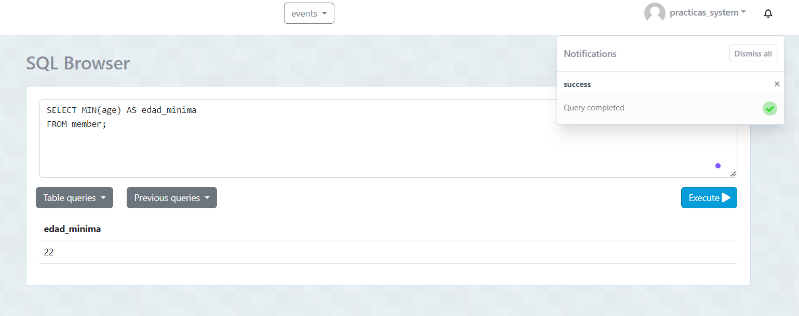
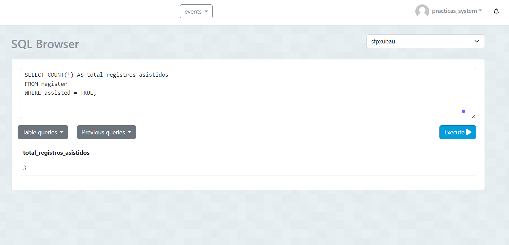
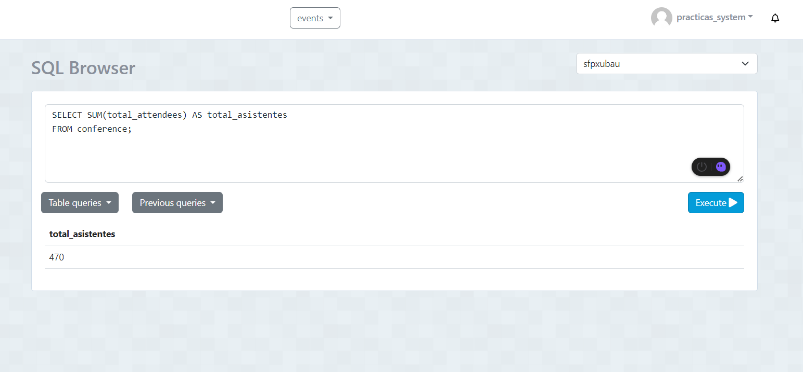
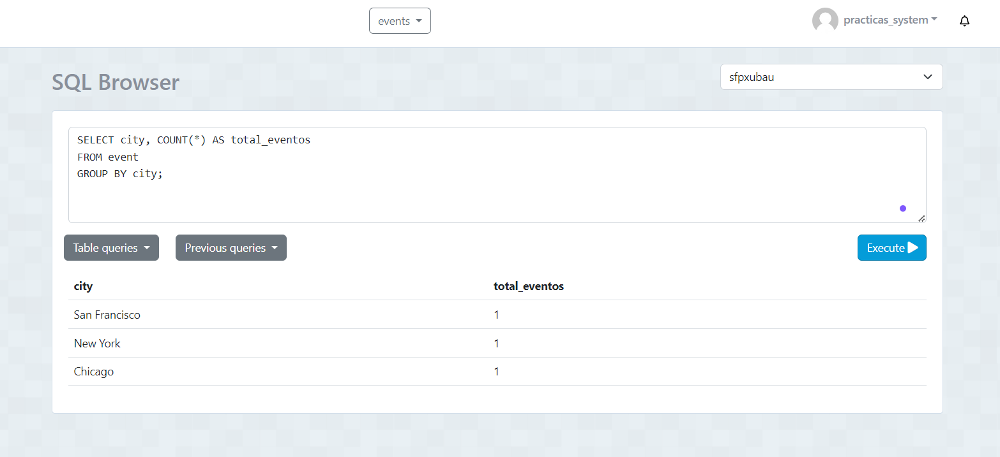
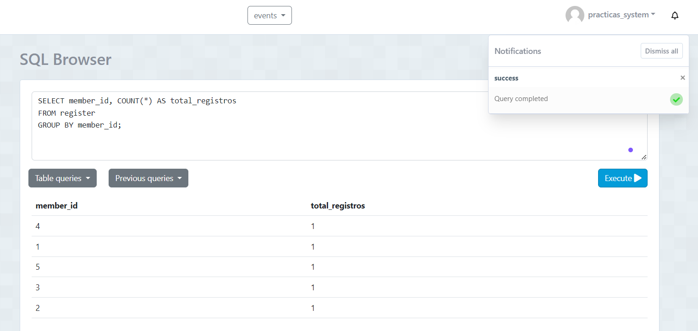
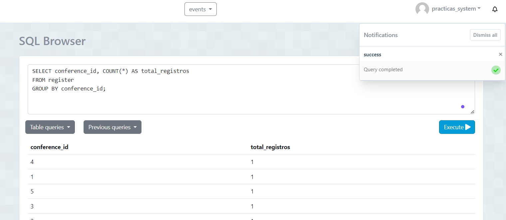

1. Obtener la edad promedio de los miembros: 

SELECT AVG(age) AS edad_promedio
FROM member;

Captura: 

2. Obtener la edad mínima de los miembros:
 
SELECT MIN(age) AS edad_minima
FROM member;

Captura: 

3. Obtener el número total de registros asistidos:

SELECT COUNT(*) AS total_registros_asistidos
FROM register
WHERE assisted = TRUE;

Captura: 

4. Obtener el número total de asistentes a todas las conferencias:
 

SELECT SUM(total_attendees) AS total_asistentes
FROM conference;

Captura: 

5. Obtener el número total de eventos por cada ciudad:

SELECT city, COUNT(*) AS total_eventos
FROM event
GROUP BY city;

Captura:

6. Obtener el número de registros por cada miembro:
 

SELECT member_id, COUNT(*) AS total_registros
FROM register
GROUP BY member_id;

Captura: 

7. obtener el número de registros por cada conferencia:
 

SELECT conference_id, COUNT(*) AS total_registros
FROM register
GROUP BY conference_id;

Captura: 

